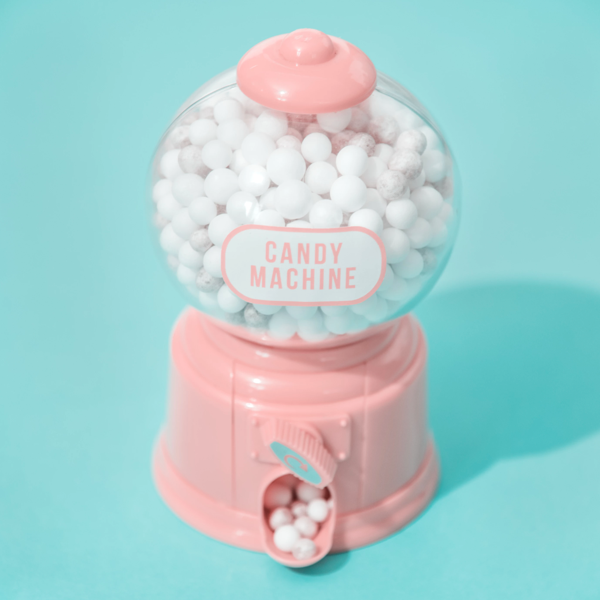

# 🍭 Museum of Candy

A modern, responsive landing page built using **HTML5**, **CSS3**, and **Bootstrap 4**. This project focuses on responsive web design, Bootstrap components, and clean UI development.

## 🚀 Live Demo

Coming Soon (GitHub Pages)

## 📸 Preview



## ✨ Features

- Fully Responsive Design
- Bootstrap Grid System
- Responsive Navigation Bar
- Beautiful Typography
- Mobile-Friendly Layout
- Custom CSS Styling

## 🛠️ Built With

- HTML5
- CSS3
- Bootstrap 4
- Google Fonts

## 📂 Project Structure

```
museum-of-candy/
│── imgs/
│── index.html
│── app.css
│── README.md
```

## 💻 Installation

1. Clone the repository

```bash
git clone https://github.com/aanjohn/museum-of-candy.git
```

2. Open the project folder.

3. Open `index.html` in your browser.

## 📚 What I Learned

- Building responsive layouts using Bootstrap
- Using the Bootstrap Grid System
- Creating responsive navigation bars
- Writing clean and reusable CSS
- Improving front-end development skills

## 👨‍💻 Author

**Aanjohn Sony**

GitHub: https://github.com/aanjohn

---

⭐ If you like this project, feel free to star the repository!